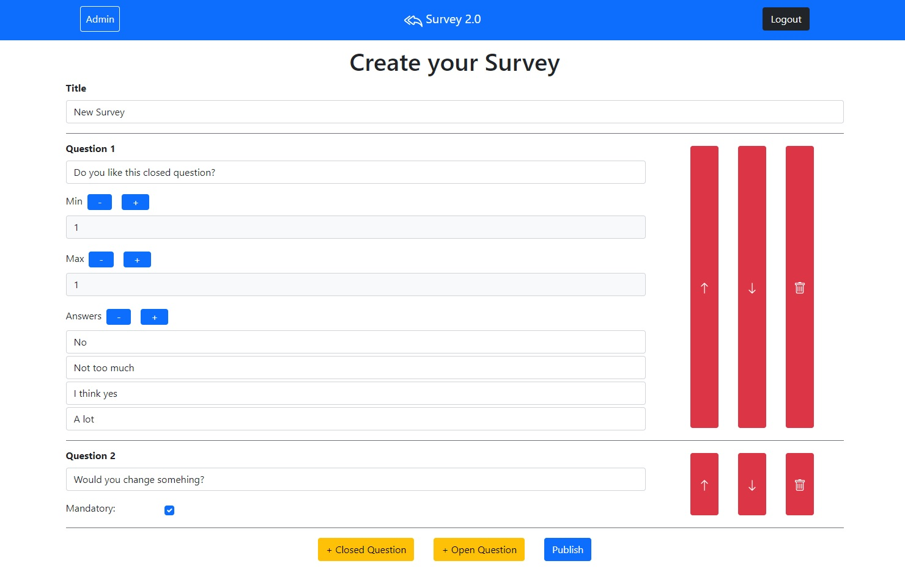

# Exam #1: "Survey"
## Student: s280139 PIPOLI VITTORIO 

## React Client Application Routes

- Route `/`: here we have the MyMain component, which is responsible for rendering the list of the surveys accordingly to  the "log-state". If you're an admin you'll see only your surveys, otherwise if you're a guest you'll see every survey.
- Route `/addSurvey`: it is reachable only by administrators, and it is used for the creation of a survey.
- Route `/answerSurvey`: it is accessible only by guests, it is used to answer to the surveys. 
- Route `/viewAnswers`: it is accessible only by admins, it is used to view the answers of the surveys. 

## API Server

- POST `/api/sessions`
  - request body: {username: "admin@polito.it", password: "admin"}
  - response body: {id:1, username: "admin@polito.it", name: "Admin"}

- DELETE `/api/sessions/current`       

- GET `/api/sessions/current`
  - response body: {id:1, username: "admin@polito.it", name: "Admin"}

- GET `/api/surveys`

- GET `/api/questions/:surveyID`
  - request parameters: surveyID
  - response body: [
                      {id:1, dOrd:1, question: "Cosa?", min:1, max:1, text:[""], type:0}, ...
                   ]

- GET `/api/answers/:surveyID`
  - request parameters: surveyID
  - response body: [
                      {ID_MainAnswer:1, ID_Survey:1, Username: "guest1", Answers:[{Answer:"non so", DisplayOrder:1}, ...],
                   ]   

- POST `/api/surveys`
  - response body: {"Title":"che bel survey", "Questions":[{"id":null, "dOrd":1, "question":"DomA", "min":0, "max":1, "text":["F"], "type":1},{"id":null, "dOrd":2, "question":"DomB", "min":1, "max":1, "text":[""], "type":0}]}

- POST `/api/answers`
  - request parameters
  - response body: {"ID_Survey":233, "Username":"Nino", "Answers":[{"answer":"[true, false]", "DisplayOrder": 1, "id_quest":294, "type":1}, {"answer":"Bello", "DisplayOrder":2, "id_quest":295, "type":0}]} 
         
         
## Database Tables

- Table `Administrators` - contains email password name
- Table `Answer` - contains ID ID_MainAnswer ID_Quest ID_Survey DisplayOrder Answer
- Table `Main_Answer` - contains ID ID_Survey Username
- Table `Quest` - contains ID ID_Survey minq maxq text type Question
- Table `Survey` - contains ID ID_Admin Title nAnswers

## Main React Components

- `MyNavBar` (in `MyNavBar.js`): navigation bar which provides login/logout functions and link to home route
- `AnswerSurvey` (in `AnswerSurvey.js`): used to view the answers of the surveys (if you are an admin), or to answer to a survey (if you are a guest).
- `AddSurvey` (in `AddSurvey.js`): used to add a survey (if you are admin).
- `MyMain` (in `MyMain.js`): used to view the list of surveys (all the surveys for guest, only the one created by an admin if he is logged).
- `MyLoginModal` (in `MyLoginModal.js`): used to log in.
- `MySurvey` (in `MySurvey.js`): used render a survey in the list with its button (View for admin to see the answers and Answer for guest in order to answer the survey).

(only _main_ components, minor ones may be skipped)

## Screenshot

## Users Credentials

- admin@polito.it, admin 
- rector@polito.it, rector 
